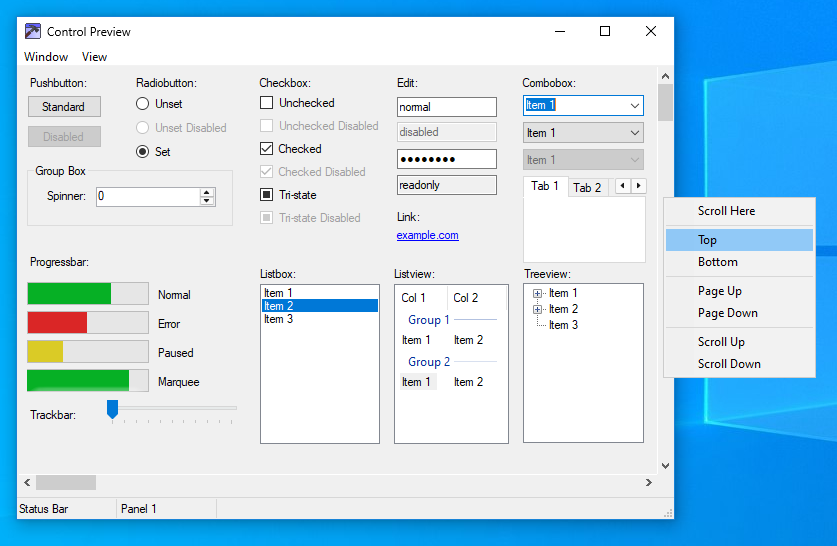

# 10ThemeFor11

> [!NOTE]  
> This theme is about 75% complete. To track its progress, check the ["Theme Progress"](https://github.com/SandTechStuff/10ThemeFor11/issues/1) issue.
> When most assets are completed, a proper theme will be provided in releases.

> [!WARNING]
> Windows builds after Canary 27813 (25H2) are not currently supported. Check https://github.com/SandTechStuff/10ThemeFor11/issues/3 for more information.

10ThemeFor11 is an `.msstyles` theme for Windows 11 that aims to provide accurate Windows 10 controls, to the greatest extent that Windows 11 allows.

# Installation

First, you need to install a UxTheme patcher to allow custom `.msstyles` themes since Microsoft locks them out by default. Some options include the Windhawk mod [UXTheme hook](https://windhawk.net/mods/uxtheme-hook) and [SecureUxTheme](https://github.com/namazso/SecureUxTheme).

_This theme has only been tested using the UXTheme hook Windhawk mod._

1. After patching UxTheme, download the latest release of the theme from [Releases](https://github.com/SandTechStuff/10ThemeFor11/releases) (10ThemeFor11.zip).
2. Extract the downloaded zip and place the contents in `C:\Windows\Resources\Themes`.

_The file structure should resemble this._

- `C:`
	- `Windows`
		- `Resources`
			- `Themes`
				- `10ThemeFor11`
				- `10ThemeFor11_Dark.theme`
				- `10ThemeFor11_Light.theme`
3. Either double click one of the `.theme` files from within the `Themes` folder or select your desired theme from within Windows settings.
4. The theme comes bundled with the Windows 10 wallpaper and accent color, but if you would prefer to use your own wallpapers or colors you can override anything through Windows personalization settings.

# Optional: Windows 10 Sounds

If you would like to use the Windows 10 sounds, grab a copy of the `C:\Windows\Media` folder from a Windows 10 install and put the contents into `C:\Windows\Resources\Themes\10ThemeFor11\Sounds`. Apply one of the included `.theme` files and the sounds should be loaded.

# Optional: Windows 10 Shadows, Corners, and Effects

Restoring the Windows 10 shadows and acrylic along with removing rounded corners and Mica requires patching `uDWM.dll`.

> [!WARNING]
> Patching DWM is no small feat! If performed incorrectly, it can temporarily prevent Windows from loading properly. While the tools displayed here are generally safe to use, make sure to create backups of `C:\Windows\System32\uDWM.dll` before proceeding.

There are two ways to apply the DWM patches: by replacing `uDWM.dll` on disk or by patching in-memory with a [Windhawk](https://windhawk.net/) mod. 

| Method       | Pros                                | Cons                                  |
|--------------|-------------------------------------|---------------------------------------|
| On Disk      | More stable, More accurate.         | Harder to install, Harder to recover. |
| Windhawk Mod | Easy to install, Easier to recover. | More bugs, Less accurate.             |

If you are less experienced with Windows modding, I recommend the Windhawk mod for ease of use. If you are well versed in Windows modding, I recommend the on disk `uDWM.dll` patch for higher accuracy and stability.

Windhawk mod: https://windhawk.net/mods/w11-dwm-fix

[@ittrgrey](https://github.com/ittrgrey)'s on disk patch: https://winclassic.net/thread/2853/udwm-borders-shadows-acrylic-windows

### Why not use the stock Windows 10 `aero.msstyles` file?

While the stock Windows 10 `.msstyles` theme works on Windows 11, it is only partially compatible. For example, the context menus and animations are broken. 10ThemeFor11 uses the assets from the stock Windows 10 `.msstyles` but reformats them in the way Windows 11 expects.